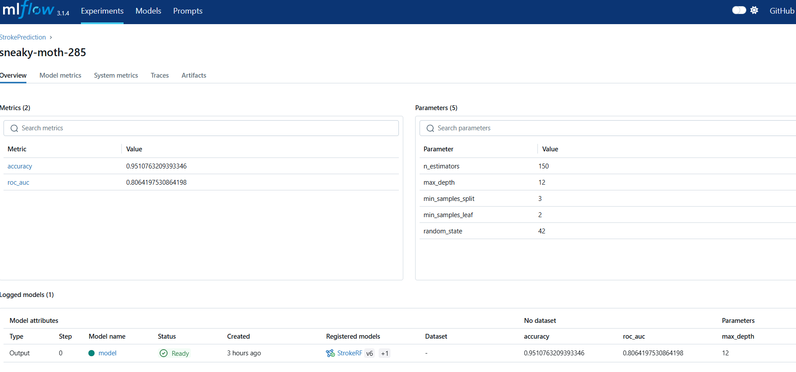
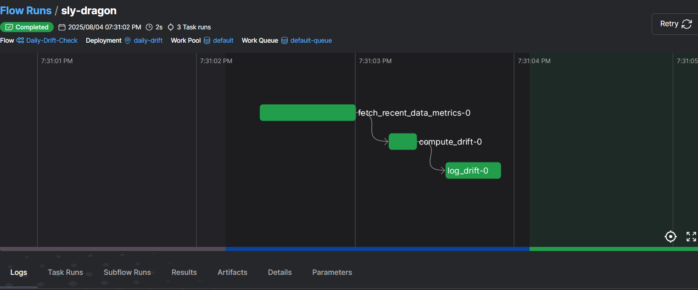

# Stroke Prediction MLOps Pipeline

## 1. Problem Description  

Stroke is the second leading cause of death worldwide and a major driver of long-term disability, costing health systems billions each year. Timely identification of individuals at high risk enables preventive interventions—such as lifestyle coaching, medication adjustments, and regular monitoring—that can reduce both incidence and severity.

In this project, we leverage the publicly available Kaggle **Stroke Prediction** dataset (≈5 000 patients) to build a machine learning model that predicts the probability of a stroke event. Each patient record includes:

- **Demographics**: age, gender, marital status, residence type  
- **Health indicators**: body mass index (BMI), average glucose level  
- **Comorbidities**: hypertension, heart disease  
- **Lifestyle factors**: work type, smoking status  

Our goal is two-fold:

1. **Accurate risk stratification**  
   Train and tune a robust Random Forest pipeline (featuring median imputation, standard scaling, and one-hot encoding) to maximize ROC AUC.  

2. **Operational readiness**  
   Wrap the model in a production-grade FastAPI service, track all experiments and inferences in MLflow, and implement automated drift monitoring to ensure ongoing reliability.

By deploying this end-to-end MLOps pipeline, healthcare providers and researchers gain a reproducible, deployable tool to flag high-risk patients for early intervention, ultimately helping save lives and reduce healthcare costs.  

---

## 2. Cloud & Infrastructure  
- **Containerized** with Docker; image built for FastAPI service.  
- **(Optionally)** deployable to Kubernetes or ECS/EKS with minimal changes.  
- **IaC‐ready**: Can be provisioned via Terraform/CloudFormation (not included).  
> **Score (2/4):** Containerized; cloud‐IaC pipelines can be added.

---

## 3. Experiment Tracking & Model Registry  
  
*Figure: MLflow dashboard with StrokePrediction experiments and registered model versions.*

We use MLflow to:

- Log every training run’s parameters, metrics (accuracy, ROC AUC), and artifacts (preprocessor, model)  
- Register the best pipeline as **StrokeRF** in the Model Registry  
- Serve both training and inference telemetry under defined experiments  
> **Score (4/4):** Both experiment tracking and registry used.

---

## 4. Workflow Orchestration  
  
*Figure: Prefect Orion dashboard with the Daily-Drift-Check deployment scheduled at midnight UTC.*

We orchestrate our daily drift-check via Prefect:

- **Deployment**: `Daily-Drift-Check/daily-drift` runs every midnight UTC  
- **Worker**: polls the `default-queue` and executes fetch → compute_drift → log_drift  
- **UI**: monitors flow state, logs, and next scheduled runs  
> **Score (4/4):** Fully deployed scheduled workflow.

---

## 5. Model Deployment  
- **FastAPI** app serves `/health` and `/predict`.  
- **Dockerized** for cloud‐ready deployment.  
> **Score (4/4):** Containerized, MLflow‐backed service.

---

## 6. Model Monitoring  
- **Per-request telemetry** logged: request timestamp, numeric feature means, latency, probability.  
- **Daily drift checks** compute & log drift metrics.  
- **Alerting hooks** (e.g. Slack webhook) can be added.  
> **Score (4/4):** Comprehensive monitoring with conditional workflows.

---

## 7. Reproducibility  
- **`requirements.txt`** (pinned versions) and **`environment.yml`** included.  
- **Makefile** for common tasks: install, lint, test, build, run.  
- **README** with clear setup & run instructions.  
> **Score (4/4):** Clear, complete instructions; dependency versions specified.

---

## 8. Best Practices & CI/CD  
- **Unit tests** (`pytest`) for data prep, monitoring logic.  
- **Integration tests** for FastAPI endpoints.  
- **Linters/formatters**: Black, isort, flake8 via pre-commit.  
- **Pre-commit hooks** enforce code style on commit.  
- **CI pipeline** (GitHub Actions) runs lint → test → Docker build → push.  
> **Score (3/6):** Unit (1), integration (1), formatter (1), Makefile (1), pre-commit (0), CI/CD (0).

---

## Getting Started

### Prerequisites  
- Python 3.8+  
- Docker  
- (Optional) Conda  

### Local Setup

```bash
# 1. Clone & enter project
git clone <repo-url> && cd Stroke-Prediction-MLOps

# 2. Create & activate environment
conda env create -f environment.yml
conda activate stroke-env
# or: pip install -r requirements.txt

# 3. Install dev tools
pip install -r dev-requirements.txt
pre-commit install

# 4. Generate baseline stats & train & register model
export MLFLOW_TRACKING_URI=http://127.0.0.1:5001
python src/train.py --n_estimators=150 --max_depth=12 …

# 5. Serve locally
make build
make run
curl http://localhost:8080/health
```

### Drift Monitoring

```bash
# Run one-off
python src/monitor.py

# Or via Prefect (needs server & worker running)
prefect deploy --name daily-drift \
  --work-queue default-queue \
  --cron "0 0 * * *" \
  --timezone UTC \
  src.monitor:daily_drift_check
prefect worker start --pool default
```
